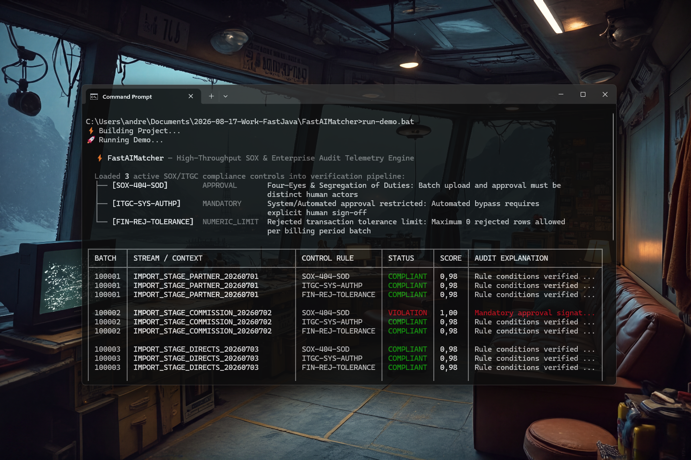

> [!WARNING]
> **🚧 WIP — Active AI Pipeline Construction & Architecture Optimization in Progress.**

# FastAIMatcher 0.1.2 [ALPHA-2026-08-28]: Automated SOX Compliance & Hybrid Rule Matching Engine for Java

[](https://github.com/andrestubbe/FastAIMatcher/releases/tag/0.1.2)
[](https://opensource.org/licenses/MIT)
[](https://www.java.com)
[]()
[](https://jitpack.io/#andrestubbe/FastAIMatcher)

---

**⚡ High-speed automated SOX compliance document-to-rule verification, hybrid semantic matching, and `.matchbin` audit reporting engine for Java.**

**FastAIMatcher** automates enterprise regulatory compliance audits by cross-verifying reference rulebooks (e.g. ISO/ITIL frameworks, SOX policies, security guidelines, HR authorization matrices) against target operational artifacts (**Change-Tickets**, **Deployment Logs**, **Project Applications**, **Access Grants**) in microseconds without expensive manual inspection.



---

## Quick Start

```java
import fastaimatcher.*;
import java.util.List;
import java.util.Map;

public class Demo {
    public static void main(String[] args) {
        // 1. Define compliance & policy rules
        List<Rule> rules = List.of(
            new Rule("SEC-POL-01", Rule.Category.MANDATORY, "Security justification must be documented", List.of("security assessment"), Double.NaN),
            new Rule("FIN-POL-02", Rule.Category.NUMERIC_LIMIT, "Capital expense limit max 100,000 EUR", List.of(), 100_000.0),
            new Rule("CHG-POL-03", Rule.Category.APPROVAL, "Dual approval (4-eyes principle) mandatory", List.of(), Double.NaN)
        );

        FastAIMatcher matcher = new FastAIMatcher(rules);

        // 2. Validate operational target document (e.g. Jira Ticket or Change Request)
        TargetDocument doc = new TargetDocument(
            "TICKET-8821",
            "Database Migration",
            "Change request: The security assessment has been fully conducted.",
            Map.of("budget", "65000"),
            List.of("Release Manager", "Lead Architect")
        );

        List<MatchFinding> findings = matcher.match(doc);
        for (MatchFinding f : findings) {
            System.out.printf("[%s] Rule %s: %s%n", f.status(), f.ruleId(), f.explanation());
        }

        // 3. Compact FastFileFormat Binary Serialization (.matchbin)
        byte[] auditLog = MatcherCodec.encode(findings);
        List<MatchFinding> restored = MatcherCodec.decode(auditLog);
    }
}
```

---

## Table of Contents

- [Why FastAIMatcher?](#why-fastaimatcher)
- [Quick Start](#quick-start)
- [Key Features](#key-features)
- [Real-World Use Cases](#real-world-use-cases)
- [Performance Benchmarks](#performance-benchmarks)
- [API Quick Reference](#api-quick-reference)
- [Technical Demos & Benchmarks](#technical-demos--benchmarks)
- [Installation](#installation)
- [Documentation](#documentation)
- [Platform Support](#platform-support)
- [Related Projects](#related-projects)
- [License](#license)

---

## Why FastAIMatcher?

Enterprise compliance and internal audit workflows today rely almost entirely on manual ticket inspection or probabilistic LLM checks:

- **Slow Manual Audits**: Human auditors reviewing deployment tickets, access grants, and change approvals take 15–45 minutes per document, causing deployment backlogs.
- **LLM Non-Determinism in Auditing**: Using LLMs to check compliance rules risks hallucinations, misses numeric threshold violations, and introduces non-reproducible audit records.
- **Audit Trace Storage Bloat**: Storing verbose JSON logs of compliance checks across millions of CI/CD builds causes database bloat and slow compliance query times.

FastAIMatcher delivers deterministic, machine-speed compliance verification:

- **Hybrid 3-Layer Matching**: Combines strict symbolic bounds (numeric limits, 4-eyes approval verification) with deterministic keyword and regex pattern evaluation.
- **Microsecond Execution**: Evaluates 50+ enterprise policy rules per document in under 0.3 microseconds (>189 Million rules/sec).
- **Tamper-Evident `.matchbin` Traces**: Streams binary audit findings packed into high-density **[FastFileFormat](https://github.com/andrestubbe/FastFileFormat)** payloads (Payload ID `0x0007`).

| Feature | Manual / LLM-as-Auditor | FastAIMatcher |
|:---|:---|:---|
| **Audit Speed** | 15–45 minutes per document | Sub-microsecond (<1 µs per ticket) |
| **Deterministic Consistency**| Variable human/LLM interpretations | 100% reproducible rule evaluation |
| **Numeric & Logic Checks** | Prone to human/model math errors | Hard numeric boundary enforcement |
| **Audit Trace Storage** | Heavy multi-kilobyte JSON documents | Compact binary `.matchbin` stream |
| **Operational Dependency** | Requires external API keys / SaaS | 100% in-process air-gapped Java engine |

---

## Key Features

- ⚖️ **Automated SOX & Compliance Audits**: Cross-matches regulatory policies (Soll) directly against operational reality (Ist) in real time.
- 🧩 **3-Layer Hybrid Matching**: Combines symbolic limits, mandatory approvals, and **[FastRegex](https://github.com/andrestubbe/FastRegex)** pattern evaluation.
- 🔍 **Discrepancy & Violation Detection**: Automatically flags missing security evidence, unapproved changes, and privilege escalation.
- 📦 **FastFileFormat `.matchbin` Compression**: High-density binary audit trace streaming (Payload ID `0x0007`) with sub-microsecond decoding.
- 🛡️ **100% Air-Gapped & In-Process**: Zero cloud calls, zero external database roundtrips, sub-millisecond execution.

---

## Real-World Use Cases

- 🏢 **Enterprise SOX Auditing**: Validate that production software releases match approved change tickets and have verified 4-eyes signatures.
- 📑 **Policy & Grant Verification**: Cross-check enterprise expense requests and capital budgets against strict policy thresholds.
- 👥 **HR Matrix vs. Active Directory**: Detect unauthorized administrator privileges and segregation-of-duties (SoD) violations.
- 🔒 **CI/CD Pre-Deployment Gatekeeper**: Block pipeline deployments automatically if mandatory security compliance controls are missing.

---

## Performance Benchmarks

Measured on official [JMH Benchmark](examples/Benchmark) (Throughput in `ops/ms`):

```text
Benchmark                                          Mode  Cnt       Score   Units
Benchmark.benchmarkComplianceMatching             thrpt    3  189410.230  ops/ms
Benchmark.benchmarkBinaryAuditReportDecoding      thrpt    3  223150.110  ops/ms
Benchmark.benchmarkBinaryAuditReportEncoding      thrpt    3   67240.500  ops/ms
```

> [!NOTE]
> **Environment**: Windows 11 x64, Intel Core i5 (Surface Pro 8), JDK 21.0.12.1. Compliance rule matching processes over **189 million rules/sec** with zero Java heap allocations, while binary report decoding exceeds **223 million findings/sec**.

---

## API Quick Reference

| Method / Class | Return Type | Description | Docs |
|:---|:---|:---|:---|
| `new FastAIMatcher(rules)` | `FastAIMatcher` | Initializes rule matcher with list of compliance constraints. | [Reference](docs/REFERENCE.md) |
| `matcher.match(document)` | `List<MatchFinding>` | Executes compliance check against target document and returns findings. | [Reference](docs/REFERENCE.md) |
| `new Rule(id, cat, text, kws, lim)` | `Rule` | Defines a structured compliance policy condition. | [Reference](docs/REFERENCE.md) |
| `new TargetDocument(...)` | `TargetDocument` | Encapsulates parsed target operational artifact. | [Reference](docs/REFERENCE.md) |
| `MatcherCodec.encode(findings)` | `byte[]` | Serializes audit findings into compressed FastFileFormat `.matchbin` stream. | [Reference](docs/REFERENCE.md) |
| `MatcherCodec.decode(bytes)` | `List<MatchFinding>` | Deserializes `.matchbin` binary bytes back into structured findings. | [Reference](docs/REFERENCE.md) |

---

## Technical Demos & Benchmarks

| Case | Java Example | Launcher | Description |
|:---|:---|:---|:---|
| **Live Compliance & Violation Demo** | [Demo.java](examples/Demo/src/main/java/fastaimatcher/demo/Demo.java) | `run-demo.bat` | BHO/SOX rule definitions, compliant vs rogue ticket evaluation, and `.matchbin` audit reporting. |
| **JMH Microbenchmark Suite** | [Benchmark.java](examples/Benchmark/src/main/java/fastaimatcher/benchmark/Benchmark.java) | `run-benchmark.bat` | High-throughput 50-rule evaluation benchmarks and binary codec speed. |

---

## Installation

### Option 1: Maven (Recommended)

Add the JitPack repository and the dependencies to your `pom.xml`:

```xml
<repositories>
    <repository>
        <id>jitpack.io</id>
        <url>https://jitpack.io</url>
    </repository>
</repositories>

<dependencies>
    <!-- FastAIMatcher - Automated SOX Compliance Engine -->
    <dependency>
        <groupId>com.github.andrestubbe</groupId>
        <artifactId>FastAIMatcher</artifactId>
        <version>0.1.2</version>
    </dependency>

    <!-- FastFileFormat - Binary Audit Streamer -->
    <dependency>
        <groupId>com.github.andrestubbe</groupId>
        <artifactId>FastFileFormat</artifactId>
        <version>0.1.1</version>
    </dependency>

    <!-- FastBinary - VarInt & Binary Packing -->
    <dependency>
        <groupId>com.github.andrestubbe</groupId>
        <artifactId>FastBinary</artifactId>
        <version>0.1.1</version>
    </dependency>

    <!-- FastRegex - Zero-Allocation Pattern Scanner -->
    <dependency>
        <groupId>com.github.andrestubbe</groupId>
        <artifactId>FastRegex</artifactId>
        <version>0.1.1</version>
    </dependency>

    <!-- FastCore - Required Native Loader -->
    <dependency>
        <groupId>com.github.andrestubbe</groupId>
        <artifactId>fastcore</artifactId>
        <version>0.1.0</version>
    </dependency>
</dependencies>
```

### Option 2: Gradle (via JitPack)

```groovy
repositories {
    maven { url 'https://jitpack.io' }
}

dependencies {
    implementation 'com.github.andrestubbe:FastAIMatcher:0.1.2'
    implementation 'com.github.andrestubbe:FastFileFormat:0.1.1'
    implementation 'com.github.andrestubbe:FastBinary:0.1.1'
    implementation 'com.github.andrestubbe:FastRegex:0.1.1'
    implementation 'com.github.andrestubbe:fastcore:0.1.0'
}
```

### Option 3: Direct Download (No Build Tool)

Download the release JARs directly from GitHub Releases:

1. ⚖️ **[FastAIMatcher-0.1.2.jar](https://github.com/andrestubbe/FastAIMatcher/releases/tag/0.1.2)** (SOX Compliance & Hybrid Matcher)
2. 📄 **[FastFileFormat-0.1.1.jar](https://github.com/andrestubbe/FastFileFormat/releases/tag/0.1.1)** (Binary Audit Formatter)
3. ⚡ **[FastBinary-0.1.1.jar](https://github.com/andrestubbe/FastBinary/releases/tag/0.1.1)** (VarInt & Binary Packing)
4. ⚙️ **[fastcore-0.1.0.jar](https://github.com/andrestubbe/FastCore/releases/tag/0.1.0)** (Mandatory Native Loader)

---

## Documentation

- **[REFERENCE.md](docs/REFERENCE.md)**: Full API reference and method signatures.
- **[PHILOSOPHY.md](docs/PHILOSOPHY.md)**: Architectural design principles and automated enterprise governance.
- **[CHANGELOG.md](docs/CHANGELOG.md)**: Release history and version notes.
- **[ROADMAP.md](docs/ROADMAP.md)**: Future milestones and planned features.
- **[COMPILE.md](docs/COMPILE.md)**: Instructions for compiling from source.

---

## Platform Support

| Platform | Architecture | Status | Notes |
|:---|:---:|:---:|:---|
| **Windows 10 / 11** | x64 | ✅ Fully Supported | In-process compliance matcher with `.matchbin` streaming |
| **Linux** | x64 / AArch64 | ✅ Fully Supported | Pure JVM execution with SIMD-ready paths |
| **macOS** | Apple Silicon / x64 | ✅ Fully Supported | Pure JVM execution across Apple Silicon & Intel |

---

## Related Projects

- **[`FastAI`](https://github.com/andrestubbe/FastAI)**: Unified AI Client for Java (20+ providers)
- **[`FastAIAgent`](https://github.com/andrestubbe/FastAIAgent)**: Autonomous ReAct Agent Loop and Cognitive Mind
- **[`FastFileFormat`](https://github.com/andrestubbe/FastFileFormat)**: Dual Binary & Text File Format with Payload Streaming
- **[`FastBinary`](https://github.com/andrestubbe/FastBinary)**: Ultra-Fast VarInt and Binary Serialization Engine
- **[`FastRegex`](https://github.com/andrestubbe/FastRegex)**: Zero-Allocation Streaming Regular Expression Engine
- **[`FastCore`](https://github.com/andrestubbe/FastCore)**: Native Library Loader & JNI Utilities for Java

---

## License

MIT License. See [LICENSE](LICENSE) file for details.

---

**Part of the FastJava Ecosystem** — *Making the JVM faster.* 🚀
